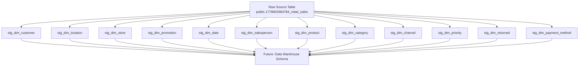
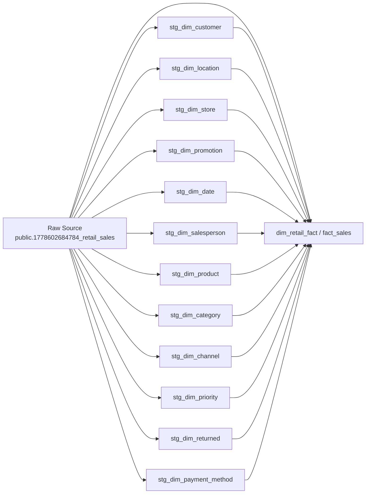

# Retail Sales Staging Project

## Overview
This project builds a staging layer for a retail sales dataset stored in PostgreSQL. The pipeline extracts raw data from a source table and normalizes attributes into staging dimension tables to prepare data for later warehouse transformation.

## Files and Purpose
- `1.CreateDB.sql` - Creates the staging and data warehouse databases.
- `2.Eda.sql` - Exploratory query to inspect raw source data.
- `3.0.stg_Dim.sql` - Full raw source query for reference and staging record review.
- `3.1.stg_Dim _customer.sql` - Staging customer dimension.
- `3.2.stg_Dim _location.sql` - Staging location dimension.
- `3.3.stg_Dim_store.sql` - Staging store dimension.
- `3.4.stg_Dim _promotion.sql` - Staging promotion dimension.
- `3.5.stg_Dim_date.sql` - Staging date dimension.
- `3.6.stg_Dim_salesperson.sql` - Staging salesperson dimension.
- `3.7.stg_Dim_product.sql` - Staging product dimension.
- `3.8.stg_Dim_category.sql` - Staging category dimension.
- `3.9.stg_Dim_channel.sql` - Staging channel dimension.
- `3.10.stg_Dim_priority.sql` - Staging priority dimension.
- `3.11.stg_Dim_returned.sql` - Staging returned status dimension.
- `3.12.stg_Dim_payment_method.sql` - Staging payment method dimension.

## Data Flow
The project follows a simple extract-load pattern:

### Detailed ETL Data Flow

## What happens in each script
1. `1.CreateDB.sql`
   - Creates two databases: `stg_retail_sales` and `dhw_retail_sales`.
2. `2.Eda.sql`
   - Runs an exploratory query to inspect raw sales records and verify column values.
3. Every `3.*.sql` script:
   - Creates a staging dimension table if it does not already exist.
   - Loads distinct values from the raw source table into that dimension.
   - Queries the staging table to verify the loaded data.

## Recommended Order of Execution
1. Run `1.CreateDB.sql` once to create the databases.
2. Run `2.Eda.sql` to inspect the raw source schema.
3. Run each `3.*.sql` script in order to build staging dimensions.
4. Use `3.0.stg_Dim.sql` as reference to review the raw source record layout.

## Table Naming and Structure
Staging tables are named with the prefix `stg_dim_` and use `snake_case` column names, for example:
- `stg_dim_customer`
- `stg_dim_location`
- `stg_dim_product`

This naming convention is useful for later ETL/ELT processes and to keep staging tables distinct from production warehouse tables.

## Diagram Notes
The Mermaid diagram above shows the current staging architecture and potential future flow into a data warehouse schema. In a future implementation, each staging dimension could feed into a structured star schema with:
- `dim_customer`
- `dim_location`
- `dim_store`
- `dim_product`
- `fact_sales`

git status